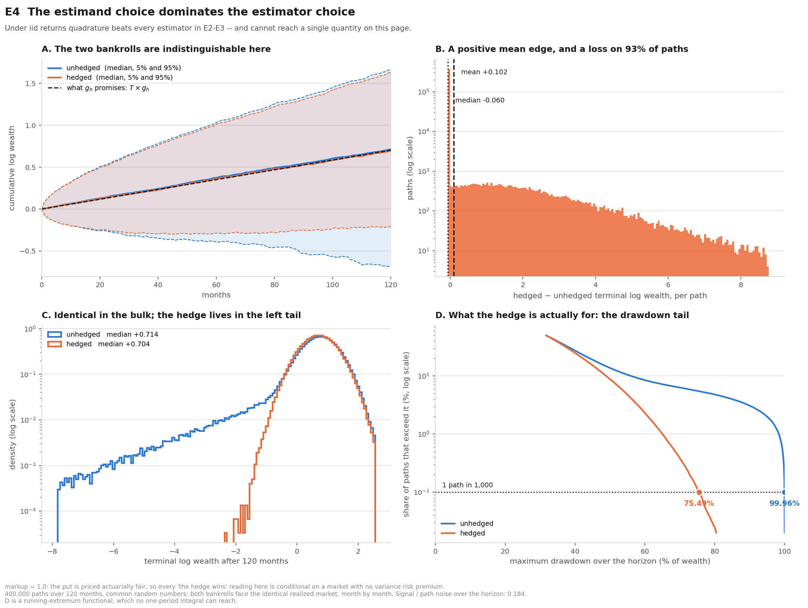

# The Ergodic Blindspot

A simulation study of crash insurance for a compounding bankroll. Each month
the bankroll spends a small, fixed share of its wealth on a far
out-of-the-money put. The question is what that hedge actually does over ten
years. It looks at three things: the average outcome, what happens on a
typical path, and the worst drawdowns.

The title refers to the gap between those views. A simulation averages over
many possible histories, but an investor lives through only one, with gains
and losses compounding along the way.

## Main finding (experiment E4)

**The hedge greatly reduces the worst drawdowns and raises the average
long-run growth. The cost is a premium paid on every path, so on most
individual paths the hedged bankroll ends slightly behind.**

400,000 ten-year paths are simulated. The hedged and unhedged bankrolls see
exactly the same market month by month, so every difference comes from the
hedge.

| result after 120 months | unhedged | hedged |
|---|---:|---:|
| 1-in-1,000 worst drawdown | **99.96%** of wealth | **75.5%** |
| 1-in-100 worst drawdown | 98.3% | 65.0% |
| mean terminal log wealth | +0.600 | **+0.702** |
| median terminal log wealth | +0.714 | +0.704 |
| 5th-percentile terminal log wealth | −0.70 | −0.22 |
| median drawdown | 31.7% | 31.7% |

- **Worst cases.** On the worst 0.1% of paths, a near-total wipeout becomes
  a 75% loss. At the median, drawdowns are unchanged.
- **Averages.** Mean log wealth rises by **+0.102 ± 0.001** over ten years,
  which is +0.00085 per month of geometric growth. This matches the
  numerical-integration benchmark.
- **Cost.** The 0.05% monthly premium is paid on every path. On the ~89% of
  paths with no crash, it costs exactly −0.060 in log wealth. The hedge ends
  ahead on only **7.1%** of paths, the ones where a put pays out.



> **Pricing caveat.** E4 prices the put at its fair expected payoff. In E4's
> market, the average gain survives until the put costs about 11× its fair
> value. Side experiment E8 uses a milder crash model and a 3× risk premium.
> There the average gain turns negative and the drawdown benefit shrinks to a
> few percentage points. See the [documentation](docs/documentation.md#e8--rolling-hedge-with-a-risk-premium-and-volatility-memory).

## Side experiments

These check whether the numbers above, and their error bars, can be trusted.
They are described in full in the [documentation](docs/documentation.md).

| | question | short answer |
|---|---|---|
| E1 | Can one Monte Carlo run price a rare payoff? | Correct on average, but the median run reports zero below ~1,100 samples. |
| E2 | Where does the simulation noise come from? | From crashes in the unhedged return; the hedge removes them. The noise-reduction methods only help when combined (163×). |
| E3 | How many samples to tell if the hedge helps growth? | ~14,000 with plain Monte Carlo; 73 with both methods. |
| E5 | Do error bars survive volatility memory? | With persistent volatility they understate uncertainty by up to 3.5×. |
| E6 | Does path roughness change extreme drawdowns? | Yes: the 1-in-1,000 drawdown varies from 38% to 55% at the same variance. |
| E7 | Are drawdown confidence intervals honest? | It depends strongly on H and the sampling design; coverage ranges from 0% to 100%. |
| E8 | What if the put carries a risk premium and volatility has memory? | The average turns negative; the tail benefit becomes small. |

Supporting evidence from S&P 500 data (1990–2026): the direction of returns
shows no memory, while volatility shows strong memory. See
[memory_evidence.md](docs/memory_evidence.md).

## Quick start

```bash
python -m venv .venv
.venv/bin/pip install -r requirements.txt
.venv/bin/python -m blindspot.experiments e4     # main finding
.venv/bin/python -m blindspot.experiments all    # every experiment
.venv/bin/python -m tests.test_regressions       # numerical checks
```

## Project map

```text
blindspot/   market model, simulation methods, and experiments
tests/       numerical checks and guards against known mistakes
figures/     charts produced by the experiments
docs/        documentation and background evidence
data/        downloadable market data cache
```

Full documentation covers the model, every experiment, commands and
limitations: **[docs/documentation.md](docs/documentation.md)**.
