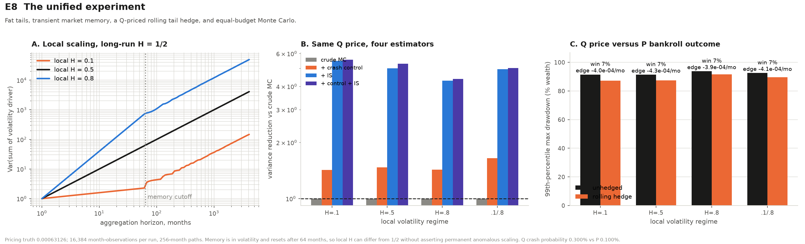

# The Ergodic Blindspot

This project asks a practical question: **how much can we trust a simulated
price for crash insurance when crashes are rare, market volatility has memory,
and an investor experiences only one path through time?**

It compares ordinary Monte Carlo simulation with methods that deliberately
reduce simulation noise. It then checks whether an accurately priced hedge
actually helps a bankroll over many months.

The title refers to a simple gap:

- A simulation averages many possible market histories.
- A real investor lives through one history, with gains and losses compounding
  along the way.

Those two views can tell different stories. An estimator can be correct on
average even though most affordable runs report zero. A hedge can improve the
average result while losing money on most individual paths. Dependence between
months can also make the usual error bars much too small.

## What the project finds

- Rare crashes make ordinary Monte Carlo estimates very uneven. The average
  across many runs can be right even when the typical run misses every crash.
- Smarter sampling can estimate the price of a put with much less noise.
- Better pricing does not make the hedge profitable. In the main scenario, the
  hedge usually loses its monthly premium but softens the worst drawdowns.
- When volatility remains high or low for long stretches, formulas that assume
  independent months understate uncertainty.
- Giving volatility a finite memory lets the model show short-run persistence
  without assuming that the same pattern lasts forever.

## Project map

```text
blindspot/   market model, simulation methods, and experiments
tests/       numerical checks and guards against known mistakes
figures/     charts produced by the experiments
docs/        background and interpretation
data/        downloadable market data cache
```

Run the main comparison with:

```bash
.venv/bin/python -m blindspot.experiments e8
```

## Main experiment: E8

E8 puts the earlier experiments together in one model:

- Normal monthly moves are mixed with occasional large losses, creating a
  much heavier left tail than a normal distribution has.
- Volatility can be rough, memoryless, or persistent within a 64-month market
  regime. The setting is summarized by the **Hurst exponent** `H`: values below
  `0.5` reverse direction quickly, `0.5` has no memory, and values above `0.5`
  tend to persist.
- The volatility signal is generated with fractional Gaussian noise (`fGn`),
  a standard model for this kind of dependence.
- After 64 months the signal resets. This means volatility can have local
  memory without that memory lasting forever.
- One scenario alternates rough (`H = 0.1`) and persistent (`H = 0.8`) regimes.
- The pricing model, called `Q`, assumes a 0.3% monthly crash chance. The model
  used for actual bankroll paths, called `P`, assumes 0.1%. This difference is
  the extra price investors pay for crash protection.
- Each month, the strategy spends 0.1% of its wealth on a put that pays when
  the market falls more than 30%.

Monthly log returns follow:

```text
r_t = drift(sigma_t, measure) + sigma_t Z_t - I_t E_t,
sigma_t = 0.05 exp(0.65 G_t),
E_t ~ Exponential(mean 0.60).
```

In plain English, the return is a normal market move plus an occasional
downward jump. The size of ordinary moves changes with the current volatility
signal. The drift is adjusted so that expected growth stays at the chosen
level under both `P` and `Q`.

### Comparing the pricing methods fairly

Each pricing run gets the same budget: 16,384 simulated months. Every method
tries to recover the same benchmark price, calculated with deterministic
numerical integration:

```text
Q put price = 0.00063126 per unit of the index
```

The four methods are:

1. **Ordinary Monte Carlo:** simulate months normally and average the put
   payoffs.
2. **Crash control:** use the known crash probability to remove some random
   noise from the estimate.
3. **Crash oversampling:** simulate crashes more often—20% instead of 0.3%—and
   reweight every result so the estimate still represents the original model.
   This is usually called *importance sampling*.
4. **Both methods together:** combine the crash control with oversampling.

Across rough, memoryless, persistent, and alternating regimes, the reduction
in variance is approximately:

| method | improvement over ordinary Monte Carlo |
|---|---:|
| crash control | 1.4–1.6× |
| crash oversampling | 4.3–5.5× |
| both methods | 4.4–5.6× |

All four methods recover the benchmark price within normal simulation error.
The lower-variance methods simply need fewer runs to reach the same precision.

That pricing improvement does not change the economics of the hedge. Because
`Q` assumes a higher crash probability than `P`, the hedge loses
about `0.0004` in average log growth per month and beats the unhedged bankroll
on only about 7% of 10-year paths. Its benefit appears in the worst outcomes:
it reduces the 99th-percentile maximum drawdown by about 2–4 percentage points,
depending on the volatility regime.



## Why long-run H returns to 0.5

A process with one fixed Hurst exponent cannot behave as if `H != 0.5` over
short periods and `H = 0.5` over very long periods. E8 handles this by joining
independent regimes of a fixed length.

For a regime length `B`, a time span `n = qB + r`, and a local Hurst exponent
`H`, the variance of the accumulated volatility signal is:

```text
Var(sum G_t) = q B^(2H) + r^(2H).
```

Within one regime, variance grows like `n^(2H)`. Across many independent
regimes, it grows in direct proportion to `n`, which is the long-run behavior
of `H = 0.5`. Test T12 checks this for every regime used by E8.

## Setup and commands

```bash
python -m venv .venv
.venv/bin/pip install -r requirements.txt

# Check the core model and its benchmark values.
.venv/bin/python -m blindspot.model

# Run the main experiment and create its chart.
.venv/bin/python -m blindspot.experiments e8

# Run every experiment without creating charts.
.venv/bin/python -m blindspot.experiments all --no-plots

# Run the numerical and regression checks.
.venv/bin/python -m tests.test_regressions

# Estimate volatility memory from S&P 500 data.
# This downloads ^GSPC the first time it runs.
.venv/bin/python -m blindspot.sp500_memory

# Demonstrate the memory estimators with synthetic data.
.venv/bin/python -m blindspot.memory
```

The experiments use fixed random seeds, so results can be reproduced. E8 uses
seeds 8080–8083 for pricing and 8180–8183 for bankroll paths. The test suite
contains 17 checks of expected numerical behavior and eight guards against bugs
found during development.

E5 keeps the conditional mean of simple returns constant, while its log
returns inherit volatility memory through variance drag. Its diagnostics
report log-return correlations at lags 1 and 100 alongside their theoretical
values.

E7 retains every run's estimate and reported interval, then measures how often
those intervals contain the simulated daily-grid benchmark. The chart shows
95% Wilson bounds for that coverage rate. Benchmark simulation uncertainty is
excluded. The separate half-width/(1.96 × RMSE) ratio compares scales and does
not establish 95% interval coverage.

## Files

| path | what it contains |
|---|---|
| `blindspot/model.py` | market models, benchmark prices, simulators, and estimators |
| `blindspot/experiments.py` | command-line runner for experiments E1–E8 and their charts |
| `blindspot/memory.py` | methods for estimating the Hurst exponent |
| `blindspot/sp500_memory.py` | memory estimates from S&P 500 data |
| `blindspot/stable_tail.py` | corrected reference code from an earlier model |
| `tests/test_regressions.py` | numerical checks T1–T17 and bug guards B1–B8 |
| `docs/memory_evidence.md` | evidence for putting memory in volatility |
| `figures/` | generated charts |
| `data/` | downloaded data that can be recreated |

## What the results do not prove

- E8 compares estimation methods; it is not a trading strategy fitted to real
  market prices.
- The return model creates rare, strongly negative outcomes, but it does not
  claim that real crashes follow a specific Pareto-style power law.
- The crash probabilities, 64-month reset, jump size, strike, and monthly spend
  are scenario choices. They should be varied before drawing financial
  conclusions.
- Memory is introduced through volatility in E5 and E8. Their log returns
  inherit dependence through volatility-dependent drift. E6–E7 use a separate
  fBm bankroll family to stress-test drawdown estimators.
- Real market regimes do not necessarily end on an exact 64-month schedule;
  the reset is a clear way to model finite memory.
- Estimates of extreme drawdowns need their own uncertainty ranges before they
  should be used as real risk limits.
